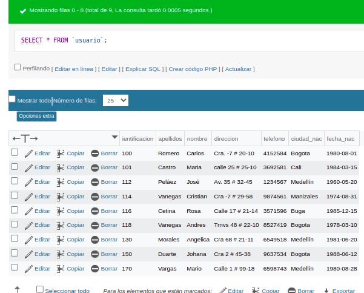

# Consulta #1 Sql

## CONSULTAS SQL

1. Para visualizar toda la información que contiene la tabla `usuario` se puede incluir con la instrucción SELECT el caracter `*` o cada una de los campos de la tabla 

- `SELECT * FROM usuario`

2. Seleccionar o visualizar solamente la identificación del usuario.

- `SELECT Identificación FROM usuario`

3. Si se desea obtener los registros cuya identificacion sean mayores o iguales a 150, se debe utilizar la consulta WHERE que especifica las condiciones que deben reunir los registros que se van a seleccionar-

- `SELECT * FROM usuario WHERE identificacion`
